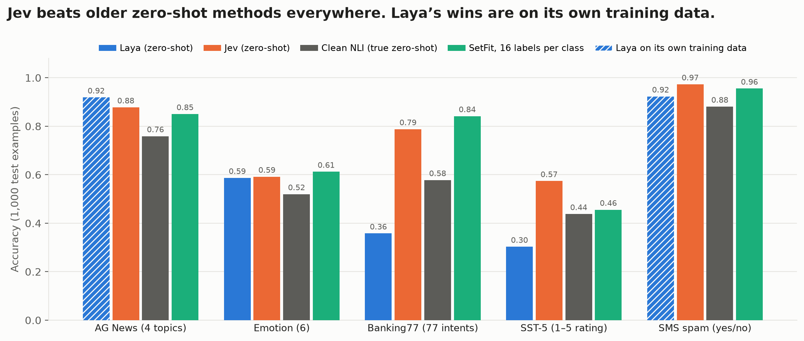

# System One models, re-examined



**Jev is a real step up over older zero-shot methods. Laya isn't: its best scores are on its own training data.
And a small classifier trained on 16–64 labels competes with both, several times faster.**

[Jev](https://typesafe.ai/blog/introducing-system-one-models-and-jev) and its open alternative
[Laya](https://github.com/NandhaKishorM/laya) answer typed questions about text with probabilities, in
milliseconds, without generating text. They compare themselves with LLMs. This repo compares them with the
classifiers we already had.

## Claims vs results

| Claim | Result |
|---|---|
| Accurate with no training | **Jev: yes.** It beats a truly zero-shot NLI model on all 5 tasks. **Laya: mixed.** It wins on AG News and spam, both in its own training data; on held-out tasks it wins Emotion and loses SST-5. |
| Fast | Yes vs LLMs. Not vs small classifiers: SetFit is 3–7× faster than Laya. |
| Calibrated | Both over-confident on the harder tasks. Jev says "100% sure" and is right 77–79% of those times on emotion and ratings. |
| No labels needed | True, but 16 labels per class let SetFit beat Laya on 4 of 5 tasks and Jev on 2 of 5. |

## Accuracy

1,000 test examples per task. *k* = labels per class, mean of 5 draws.

| Task | Laya | Jev | Clean NLI (zero-shot) | SetFit k=16 | SetFit k=64 |
|---|---|---|---|---|---|
| AG News (4 topics) | **0.919**¹ | 0.878 | 0.759 | 0.850 | 0.877 |
| Emotion (6) | 0.587 | 0.592 | 0.520 | 0.612 | **0.772** |
| Banking77 (77 intents) | 0.358 | 0.788 | 0.578 | 0.842 | **0.889** |
| SST-5 (1–5 rating) | 0.303 | **0.574** | 0.438 | 0.456 | 0.516 |
| SMS spam | 0.923¹ | **0.973** | 0.881 | 0.955 | 0.972 |

¹ In Laya's training mix, per its own README. "Clean NLI" is DeBERTa-v3-large-zeroshot-v2.0**-c**, trained only on
synthetic data plus general NLI data, so it has never seen these tasks. Confidence intervals: [`RESULTS.md`](results/RESULTS.md).


## Speed

Median ms per decision on an M4 Pro, one method per process.

| Method | AG News (4 options) | Banking77 (77 options) |
|---|---|---|
| Laya (PyTorch, same framework as the rest) | 28.4 | 64.2 |
| Laya (MLX, its optimised runtime) | 20.3 | 50.2 |
| Clean NLI, base | 23.9 | 119.6 |
| SetFit | 8.7 | 9.0 |
| Embeddings + LR | 6.2 | 5.8 |
| Jev (API, with network) | ~830 | ~850 |


Laya and NLI read every option, so they slow down as options grow. SetFit reads only the text.

## Calibration


Below the diagonal means over-confident. Both System One models are, on Emotion and SST-5.

## Did they train on the test datasets?

- **Laya:** its README lists AG News as "in training mix" and Emotion and SST-5 as held out. Spam was in its mix too.
- **Jev:** training data isn't published.
- **Fresh-news probe:** we labelled 161 news articles published after Jev's launch, so no model could have seen them.

| Model | AG News | Fresh news | Change |
|---|---|---|---|
| Clean NLI (never saw AG News) | 0.759 | 0.832 | +7 |
| Jev | 0.878 | 0.919 | +4 |
| **Laya** (trained on AG News) | 0.919 | 0.876 | **−4** |

The fresh set is easier for models that never saw AG News. **Laya is the only one that fell.** Jev rose, but less than
the clean model, which fits partial exposure or just a ceiling effect. With 161 examples, that part is inconclusive.

## Laya's own benchmark

On [typed-decisions](https://huggingface.co/datasets/LocalLLaMA/typed-decisions) we reproduce Laya exactly.

| Method | Accuracy |
|---|---|
| Laya, fine-tuned on this benchmark | **0.767** |
| Jev, zero-shot | 0.736 |
| Majority baseline | 0.484 |
| Laya, zero-shot | 0.361 |

Zero-shot, Laya is below the majority baseline. In its own README's words, Laya is "a fast base to specialise,
not a zero-shot decision engine."

## Also found

- Reordering the options changes Laya's answer on 1–6% of examples. NLI: never.
- With 77 options, Laya cuts labels to 3 tokens and some become identical.
- Accuracy numbers use the MLX port of Laya. The official PyTorch release gives identical answers on all 400 checked examples.

## Which to use

| Situation | Use |
|---|---|
| No labels, want the best accuracy | **Jev** |
| ~16–64 labels per category, speed matters | **SetFit** |
| No labels, must run locally and free | Clean zero-shot NLI, or Laya for topic-style tasks |

## Method

- **Same everything:** 1,000 fixed test examples, the same wording for every zero-shot model, the same machine for speed.
- **Calibration** fixed with temperature scaling on a separate 500-example split, never on test.
- **Every prediction** saved in [`results/preds/`](results/preds/).
- **Mistakes we caught:** SetFit trained 1,000 fixed steps instead of one epoch; the first speed test leaked GPU memory into swap; our first "zero-shot" NLI model had been trained on these datasets (replaced with the clean `-c` version). All fixed and re-run.
- **Limits:** Jev is an API and can change (`jev-1.13.0`, Sept 2026). Five English tasks plus one synthetic benchmark.

## Reproduce

```bash
uv venv --python 3.11 && uv pip install -e ".[dev,laya,nli,fewshot]"
s1x run laya ag_news                     # zero-shot
s1x fewshot setfit ag_news --k 8 16 64   # few-label
python -m s1x.latency --out results/latency_mine.json
python scripts/fresh_news.py && python scripts/fresh_eval.py report
s1x report && python scripts/make_figures.py
```

Jev needs `TYPESAFE_API_KEY` in `.env.local`. Laya-MLX needs Apple Silicon.

## Related

[Laya](https://github.com/NandhaKishorM/laya) · [laya-mlx](https://github.com/mizorewww/laya-mlx) ·
[Jev](https://typesafe.ai/blog/introducing-system-one-models-and-jev) ·
[decision-model-benchmark](https://github.com/nibzard/decision-model-benchmark) (Jev vs LLMs) ·
Yin et al. 2019 (NLI zero-shot) · Tunstall et al. 2022 (SetFit) · Guo et al. 2017 (calibration)

---

By [Moinuddin Shaik](https://moinuddin.app) · full results in [`RESULTS.md`](results/RESULTS.md)
