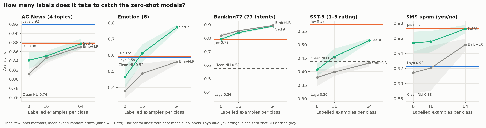
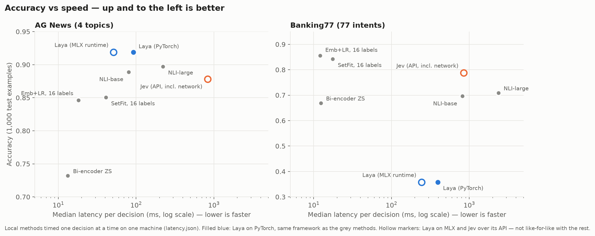
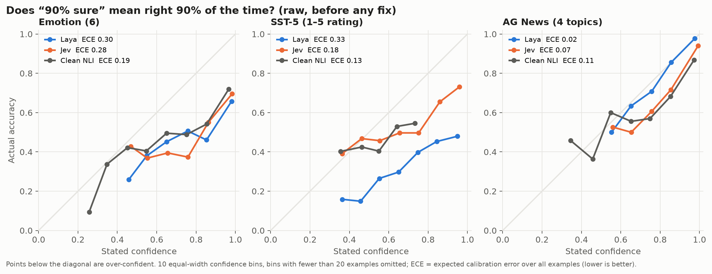

# System One models, re-examined

**Are "System One" decision models a new capability — or fast packaging of classifiers we already had?**

[TypeSafe's Jev](https://typesafe.ai/blog/introducing-system-one-models-and-jev) and its open counterpart
[Laya](https://github.com/NandhaKishorM/laya) answer typed questions about text — pick an option, rate on a
scale, yes/no — with calibrated probabilities in milliseconds and no text generation. Jev compares itself
only with LLMs. Laya compares itself only with Jev. This benchmark compares both with the classifiers that
came before them, on the same test sets, the same wording and the same machine.

> **The answer:** fast packaging of an older idea, not a new capability. Each model owns one task type —
> Laya news topics, Jev ratings. Everywhere else, a 2021 zero-shot model or a classifier trained on 16
> labels per class matches or beats them, and the small classifiers are several times faster.

---

## Key findings

1. **Each System One model wins exactly one task type.** Laya is the most accurate model we ran on news
   topics (AG News 0.919 — no amount of labels caught it). Jev is the most accurate on 1–5 ratings (SST-5 0.574).
2. **Older methods match or beat them everywhere else.** A zero-shot NLI model smaller than Laya
   (DeBERTa-v3-base, 2021) beats Laya on 4 of 5 tasks. SetFit with 16 labels per class beats Laya on 4 of 5.
3. **Fast next to LLMs, not next to small classifiers.** Same machine, same framework: SetFit is 3–7× faster
   than Laya and embeddings + logistic regression 5–11×. Their cost stays flat as the number of options grows;
   Laya's and NLI's does not.
4. **"Calibrated" doesn't hold out of the box.** Both are over-confident on the harder tasks; after standard
   temperature scaling they are no better calibrated than anything else. Jev reports exactly 100% confidence on
   up to 62% of predictions — and is right only 77–79% of those times on Emotion and SST-5.
5. **Laya's own benchmark reproduces exactly** (base 0.361, fine-tuned 0.7665). Zero-shot, base Laya scores
   below the majority baseline — as its own documentation says. The headline 0.766 comes from training on that
   benchmark's own train split.
6. **Laya is sensitive to presentation.** Reordering the options changes its answer on 1.3–5.7% of examples
   (NLI: 0%). With 77 options, its 192-token option budget cuts labels to 3 tokens and makes some identical.

**Credit where it's due:** typed decisions in tens of milliseconds with no generation is a genuine engineering
win over LLMs, and Laya's repository is unusually candid about its own limits.

---

## Accuracy

1,000 fixed test examples per task. Zero-shot models use no labels; SetFit and Emb+LR use *k* labelled
examples per class (mean of 5 random draws).

| Task | Laya | Jev | NLI-base (2021) | SetFit k=16 | SetFit k=64 | Emb+LR k=64 |
|---|---|---|---|---|---|---|
| AG News (4 topics) | **0.919** | 0.878 | 0.889 | 0.850 | 0.877 | 0.871 |
| Emotion (6) | 0.587 | 0.592 | 0.741 | 0.612 | **0.772** | 0.559 |
| Banking77 (77 intents) | 0.358 | 0.788 | 0.696 | 0.842 | 0.889 | **0.895** |
| SST-5 (1–5 rating) | 0.303 | **0.574** | 0.476 | 0.456 | 0.516 | 0.432 |
| SMS spam (yes/no)¹ | 0.923 | 0.973 | **0.986** | 0.955 | 0.972 | 0.951 |

¹ Spam was in Laya's training mix, so it is not a clean zero-shot test for Laya.
Paired bootstrap 95% confidence intervals for every comparison are in [`results/RESULTS.md`](results/RESULTS.md).

### How many labels does it take to catch them?



SetFit passes Laya with **8 labels per class** on Banking77, SST-5 and spam, and with **16** on Emotion.
On AG News it never does. Against Jev, it wins on Emotion and Banking77 and ties or trails elsewhere.

---

## Speed

Median milliseconds per decision, one decision at a time, model load excluded. Apple M4 Pro (24 GB), each
method in its own process, swap flat throughout ([`results/latency_m4.json`](results/latency_m4.json), memory log
alongside).

| Method | AG News (4 options) | Banking77 (77 options) |
|---|---|---|
| Laya, PyTorch — same framework as the rest | 28.4 | 64.2 |
| Laya, MLX — its optimised runtime | 20.3 | 50.2 |
| NLI-large (DeBERTa-v3-large) | 63.8 | 372.9 |
| NLI-base (DeBERTa-v3-base) | 23.9 | 119.6 |
| SetFit | 8.7 | 9.0 |
| Embeddings + logistic regression | 6.2 | 5.8 |
| Jev — API round trip, includes network | ~830 | ~850 |



Up and to the left is better. On Banking77, Laya sits at the bottom while the few-label classifiers sit top-left:
more accurate and roughly 7–11× faster.

---

## Calibration



Points below the diagonal are over-confident. On Emotion and SST-5, both System One models claim far more
certainty than they deliver; on AG News all three are close to honest.

---

## On Laya's own benchmark

[`LocalLLaMA/typed-decisions`](https://huggingface.co/datasets/LocalLLaMA/typed-decisions): 400 test cases,
2,000 decisions across four workflows (agent traces, customer service, invoices, security incidents).

| Method | Labels used | Accuracy | Published |
|---|---|---|---|
| Laya, base (zero-shot) | 0 | 0.361 | 0.361 |
| Laya, fine-tuned on this train split | 6,000 decisions | **0.7665** | 0.766 |
| Jev (zero-shot) | 0 | 0.736 | 0.727 |
| NLI-base (zero-shot) | 0 | 0.486 | – |
| Embeddings + LR, one head per question (trained on train) | 6,000 decisions | 0.564 | – |
| Majority (our definition)² | train frequencies | 0.4835 | 0.461 |

² Laya's script hard-codes 0.461 with no code behind it; our definition (most frequent label per workflow and
question) is stated in `RESULTS.md`. The gap changes no conclusion.

---

## Which one should you use?

| Your situation | Use |
|---|---|
| You can label ~16 examples per category | **SetFit** — most accurate on most tasks, and the fastest |
| No labels, or categories that keep changing | **NLI zero-shot** (DeBERTa-v3-base) — free, local, strong |
| Ratings or scales, zero labels, API latency is acceptable | **Jev** |
| Topic routing, zero labels, on a Mac, latency-critical | **Laya** |

---

## Method

- **Contenders.** Majority baseline · Laya zero-shot (laya-mlx; upstream PyTorch for timing) · Jev (API) ·
  NLI zero-shot with DeBERTa-v3-large and -base (all options for one input in one batched pass) · bi-encoder
  zero-shot (bge-small/base) · SetFit (paraphrase-mpnet-base-v2, the paper's default recipe) and bge-small
  embeddings + logistic regression at k ∈ {8, 16, 64} × 5 seeds.
- **Tasks.** AG News and DAIR Emotion (both in Laya's own results table), Banking77, SST-5, SMS spam, and Laya's
  typed-decisions benchmark.
- **Hygiene.** Fixed test (1,000), calibration (500) and k-shot splits committed by row id. Identical
  instruction and label wording for every zero-shot method. Temperatures fit only on the calibration split.
  Every per-example prediction is cached in [`results/preds/`](results/preds/), so any number can be recomputed.
- **Metrics.** Accuracy, macro-F1, ECE (15 bins) before and after temperature scaling, accuracy on the
  most-confident 80%, MAE and QWK for SST-5, paired bootstrap 95% CIs.

### What we got wrong along the way (and fixed)

- **SetFit trained for a fixed 1,000 steps instead of one epoch** (a `max_steps` setting overrides `num_epochs`).
  Found by profiling; every affected run was redone with the paper's recipe.
- **The first speed benchmark leaked GPU memory.** Loading nine models in one process never released MPS/MLX
  memory, pushing the machine into swap. Each method now runs in its own process; the numbers above come from
  that clean run.

## Limitations

- Laya scores 1–7 points below its model card on shared tasks. Upstream PyTorch Laya gives the same answers as
  the MLX port (200/200), so the likely causes are prompt wording and test subsets; Laya's prompts aren't published.
- Jev is a moving API target: numbers are for `jev-1.13.0` as served in September 2026.
- Five English tasks plus one synthetic benchmark; results may differ on long documents, other languages, or
  multi-question workloads, where Laya's batching of questions helps.

## Reproduce

```bash
uv venv --python 3.11 && uv pip install -e ".[dev,laya,nli,fewshot]"
s1x splits ag_news emotion banking77 sst5 sms_spam
s1x run laya ag_news                       # any zero-shot method × task
s1x fewshot setfit ag_news --k 8 16 64     # few-label grid
s1x td laya                                # Laya's typed-decisions benchmark
python -m s1x.latency --out results/latency_mine.json
s1x report                                 # rebuilds results/RESULTS.md
python scripts/make_figures.py
```

Jev needs `TYPESAFE_API_KEY` in a gitignored `.env.local`. Laya-MLX needs Apple Silicon.

## Related work

- [Laya](https://github.com/NandhaKishorM/laya), its [MLX port](https://github.com/mizorewww/laya-mlx), and
  [TypeSafe's Jev](https://typesafe.ai/blog/introducing-system-one-models-and-jev).
- [nibzard/decision-model-benchmark](https://github.com/nibzard/decision-model-benchmark) — Jev against eight
  LLMs and trivial baselines, no trained classifiers.
- Yin, Hay & Roth 2019 — zero-shot classification as NLI. Tunstall et al. 2022 — SetFit.
  Guo et al. 2017 — temperature scaling.

---

Built by [Moinuddin Shaik](https://moinuddin.app). Full tables, per-task caveats and latency detail:
[`results/RESULTS.md`](results/RESULTS.md).
